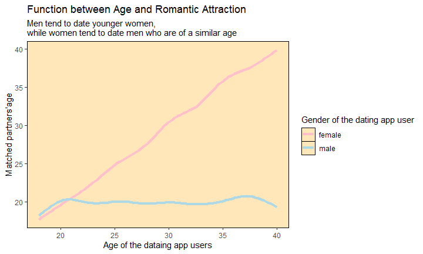
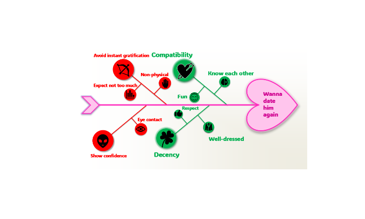

## Key Public Health Research Methods

-   Reviews
-   Quantitative approach 
-   Qualitative approach 
-   Mixed-method approach  

## Reviews  
-   Literature reviews
-   Systematic reviews  

## Quantitative approach  
-   produce numeric answers
-   take measurements and processed statistically
-   make prediction
-   establish relationships between the measured variables 
-   start with hypothesis or theory
-   end with deduction through analysis of collected data
-   major resource for evidence-based practice  

## Advantages and Disadvantages of Quantitative Approach  
-   Advantages  
    -   can produce objective answers
    -   can generalize the results with a good design and conduct 
-   Disadvantages
    -   may require large sample size to make inference about population
    -   focus on a narrow research question
    -   require robust study design
    
## Quantitative study designs
-   Descriptive study
    -   Cross-sectional study  
    -   Epidemiological surveys 
-   Analytic study
    -   Case control study
    -   Cohort study
-   Experimental study
    -   Randomized controlled trial
    -   Quasi experimental study
    
## Case study: quantitative research

Let's say, we've collected data of 10,000 users from dating apps such as **tinder**, **match** ,etc.

## But the data is really messy

| id| age_female| age_male| match_age_female| match_age_male|
|--:|----------:|--------:|----------------:|--------------:|
|  1|         28|       99|               25|             99|
|  2|         99|       28|               99|             21|
|  3|         20|       99|               19|             99|
|  4|         99|       22|               99|             18|
|  5|         19|       99|               18|             99|

## So we run a few codes to tidy up

`data %>% pivot_wider(id_cols = id, names_from = gender, values_from = c(age, match_age), values_fill = 99) %>% pivot_longer(cols = -id, names_to = c(".value", "gender"), names_pattern = "(age|match_age)_(female|male)") %>% mutate(across(c(age, match_age), ~ na_if(., 99))) %>% filter(complete.cases(.))`

## And we get this tidy data and now our data has meaning

| id|gender | age| match_age|
|--:|:------|---:|---------:|
|  1|female |  28|        25|
|  2|male   |  28|        21|
|  3|female |  20|        19|
|  4|male   |  22|        18|
|  5|female |  19|        18|

## We use statistics to see what we could know from our data

$$matched\_age = \alpha + \beta_1 \times age + \beta_2 \times gender$$

## And here is what we got

<!-- -->

## Qualitative approach
-   produce descriptions (words)
-   explore feeling, understanding, experiences, etc
-   observe and explain human behavior
-   start with description about behavior, experience, feeling,etc
-   end with induction of a theory to explain the findings
-   process description into categories and themes 
-   study designs may be dynamic

## Advantages and disadvantages of Qualitative approach
-   Advantages
    -   can cover a broader aim and objective
    -   small sample with in-depth data is enough for understanding
    -   Themes produced can be transferred to similar context
    -   can construct theory

-   Disadvantages
    -   subjective answers generated by researchers and study participants
    -   results cannot be generalized because context is specific
    -   dynamic study design may be intensive
    
## Qualitative study designs
-   Qualitative interviews
-   Focus group research
-   Qualitative observational methods
-   Ethnography
-   Thematic analysis
-   Grounded theory
-   Nominal group technique
-   Delphi process

## Case study: Qualitative research
Here, we’ve asked the women from Reddit what they expected on their first date

## Some of their answers
-   "Getting to know each other life: hobbies, work, funny stories, personality, values (not too deep for a first date but enough to make sure we align)"
-   "I expect to be treated with courtesy and respect. I hope to get to know that person a bit better and see if we may be a good fit."
-   "Basic human decency and just getting to know each other"
-   "Many people have far too many expectations from a first date, when they should only really serve as a compatibility test. If something comes out of it, great, but never approach a first date expecting instant gratification."
-   "To spend some time together, preferably over drinks, and see if there’s chemistry and a mutual interest in getting to know each other better."

## Read, read, read and make manageable chunks
|Code|Text|
|:----:|:----|
|Compatibility|Getting a good feel of my date’s personality and values, establish if there’s basic compatibility|
|Getting to know each other|I hope to get to know that person a bit better|
|Not instant gratification|never approach a first date expecting instant gratification|
|Decent behavior|I expect to be treated with courtesy and respect|

## Results

Fishbone diagram showing women's expectation on first date

  
